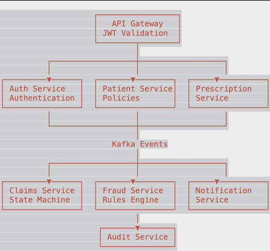

# ClaimBridge 

A production-grade, event-driven Healthcare Insurance Claims Management System built with Spring Boot Microservices, Apache Kafka, PostgreSQL, and Docker.

ClaimBridge streamlines the healthcare insurance claim lifecycle by enabling hospitals and insurance providers to securely manage patients, prescriptions, claims processing, fraud detection, notifications, and audit tracking in a scalable microservices architecture.

---

## ✨ Features

###  Authentication & Authorization

* JWT-based authentication and authorization
* Role-Based Access Control (RBAC)
* Centralized security through API Gateway
* Multi-tenant architecture with Hospital and Insurer isolation

###  Claims Management

* End-to-end healthcare claim processing
* State-driven claim workflow
* Claim approval and rejection process
* Policy validation and insurer assignment

###  Fraud Detection Engine

* Strategy Pattern-based fraud validation
* Duplicate claim detection
* Excessive claim amount checks
* High-frequency provider monitoring
* Expired prescription validation

###  Event-Driven Communication

* Apache Kafka-powered asynchronous messaging
* Decoupled microservices architecture
* Reliable event processing
* Outbox Pattern for guaranteed message delivery

###  Audit & Compliance

* Append-only audit trail
* Complete claim activity tracking
* Immutable event history
* Compliance-focused logging

###  Notifications

* Email notifications for claim status updates
* Event-driven notification processing

---

##  Architecture

``` 

```

---

##  Tech Stack

### Backend

* Java 21
* Spring Boot 3.x
* Spring Security
* Spring Data JPA
* OpenFeign

### Microservices & Infrastructure

* Spring Cloud Gateway
* Netflix Eureka
* Apache Kafka
* Docker & Docker Compose

### Database

* PostgreSQL

### Security

* JWT Authentication
* Role-Based Access Control (RBAC)

---

## 📦 Microservices

| Service              | Port | Description                                |
| -------------------- | ---- | ------------------------------------------ |
| API Gateway          | 8080 | Routing and JWT validation                 |
| Eureka Server        | 8761 | Service discovery                          |
| Auth Service         | 8081 | Authentication and user management         |
| Patient Service      | 8082 | Patients, insurers, and insurance policies |
| Prescription Service | 8083 | Prescription management                    |
| Claims Service       | 8084 | Claim lifecycle and workflow management    |
| Fraud Service        | 8085 | Fraud detection and validation             |
| Notification Service | 8086 | Email notifications                        |
| Audit Service        | 8087 | Audit logging and compliance               |

---

##  Claim Lifecycle

```text
DRAFT
 ↓ 
 SUBMITTED 
 ↓ 
 UNDER_REVIEW 
 ├──► FLAGGED ─► UNDER_REVIEW 
 ├──► REJECTED 
 └──► PRE_APPROVED 
            ↓ APPROVED 
            │ 
            └──► PARTIALLY_APPROVED 
                           ↓ SETTLED 
                           
CANCELLED (can occur before settlement)
```

---

##  Kafka Event Flow

| Topic                | Producer       | Consumer                            |
| -------------------- | -------------- | ----------------------------------- |
| claim.submitted      | Claims Service | Fraud Service, Audit Service        |
| claim.approved       | Claims Service | Notification Service, Audit Service |
| claim.rejected       | Claims Service | Notification Service, Audit Service |
| fraud.flagged        | Fraud Service  | Claims Service, Audit Service       |
| hospital-created     | Auth Service   | Patient Service                     |
| insurer-created      | Auth Service   | Patient Service                     |
| organization-updated | Auth Service   | Patient Service                     |

---

##  Fraud Detection Rules

| Rule                      | Description                                     |
| ------------------------- | ----------------------------------------------- |
| DuplicateClaimRule        | Flags duplicate claims submitted within 30 days |
| ExcessiveAmountRule       | Flags unusually high claim amounts              |
| HighFrequencyProviderRule | Flags providers submitting excessive claims     |
| ExpiredPrescriptionRule   | Rejects claims linked to expired prescriptions  |

---

##  User Roles

| Role               | Description             |
| ------------------ | ----------------------- |
| ROLE_HOSPITAL      | Hospital Administrator  |
| ROLE_HOSPITAL_USER | Hospital Staff          |
| ROLE_INSURER       | Insurance Administrator |
| ROLE_INSURER_USER  | Insurance Staff         |

---

##  Design Patterns & Architecture Patterns

### Design Patterns

* Strategy Pattern (Fraud Detection Rules)
* State Pattern (Claim Lifecycle Management)

### Architecture Patterns

* Microservices Architecture
* Event-Driven Architecture
* API Gateway Pattern
* Service Discovery Pattern
* Outbox Pattern
* Database per Service Pattern

---

##  Getting Started

### Prerequisites

* Java 21
* Maven 3.9+
* Docker Desktop
* Git

### Clone the Repository

```bash
git clone https://github.com/Singhashish-commits/ClaimBridge.git
cd ClaimBridge
```

### Configure Environment Variables

```bash
cp .env.example .env
```

Update the `.env` file with your configuration values.

### Start the Application

```bash
docker compose up --build
```

### Access Services

| Service          | URL                   |
| ---------------- | --------------------- |
| Eureka Dashboard | http://localhost:8761 |
| API Gateway      | http://localhost:8080 |

---

##  Project Structure

```text
ClaimBridge/
├── docker-compose.yml
├── .env.example
├── init-db.sql
├── Gateway/
├── Eureka-Server/
├── Auth-Service/
├── Patient-Service/
├── Prescription-Service/
├── Claims-Service/
├── Fraud-Service/
├── Notification-Service/
└── Audit-Service/
```

---

##  Future Enhancements

* Distributed Tracing with OpenTelemetry
* Prometheus & Grafana Monitoring
* CI/CD Pipeline with GitHub Actions
* Kubernetes Deployment
* Saga Pattern for Distributed Transactions
* ML-Based Fraud Detection
* Centralized Logging with ELK Stack

---

##  Key Highlights

* Multi-Tenant Healthcare Claims Platform
* Event-Driven Microservices Architecture
* Kafka-Based Asynchronous Communication
* Fraud Detection Rules Engine
* JWT Authentication & RBAC
* Outbox Pattern Implementation
* Append-Only Audit Trail
* Production-Oriented System Design
